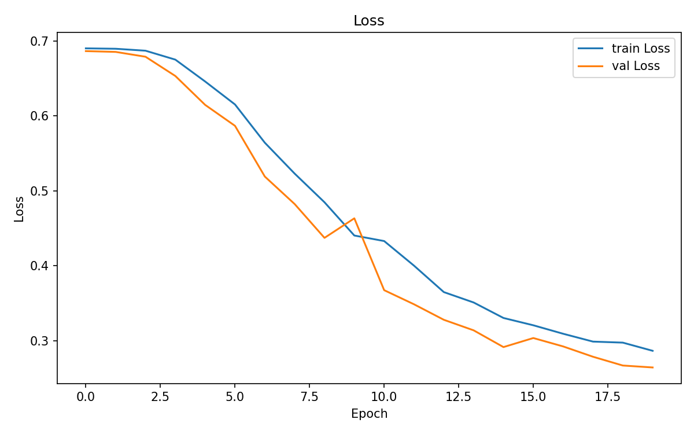
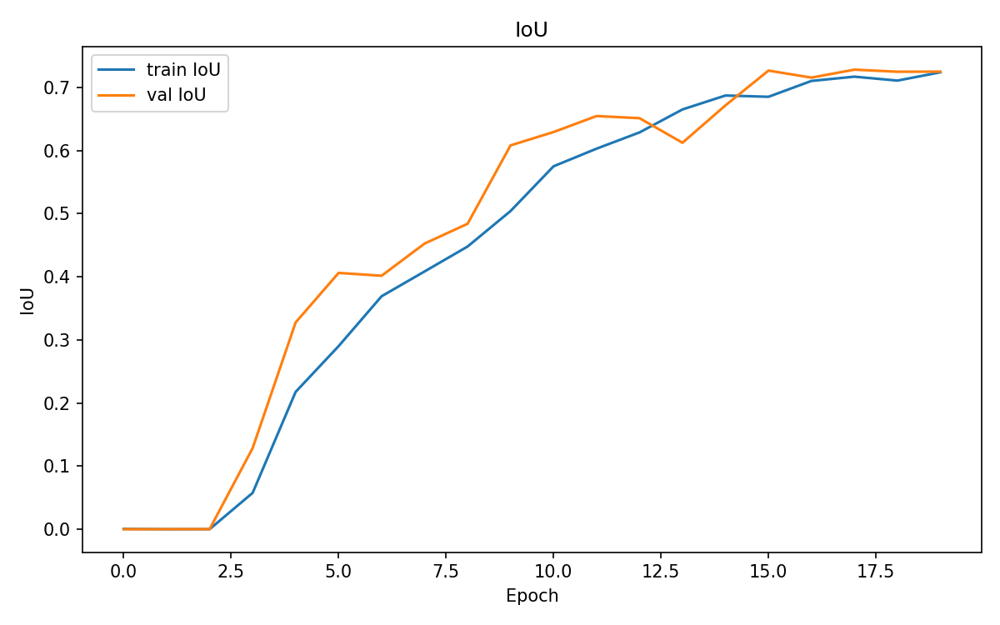
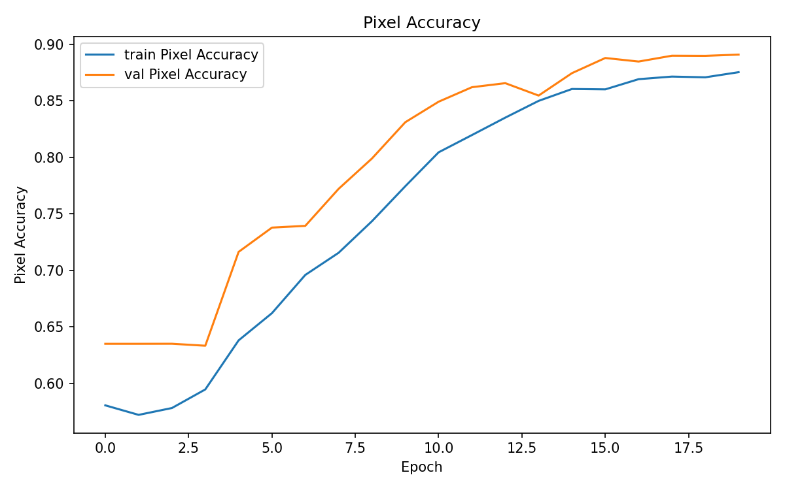
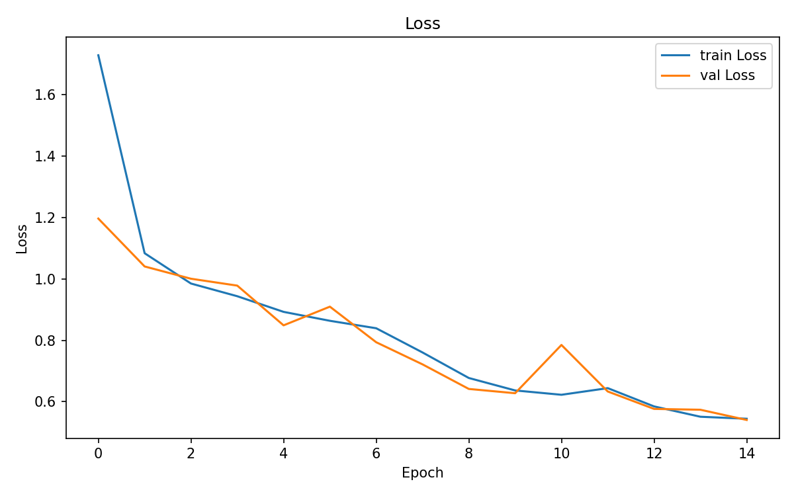
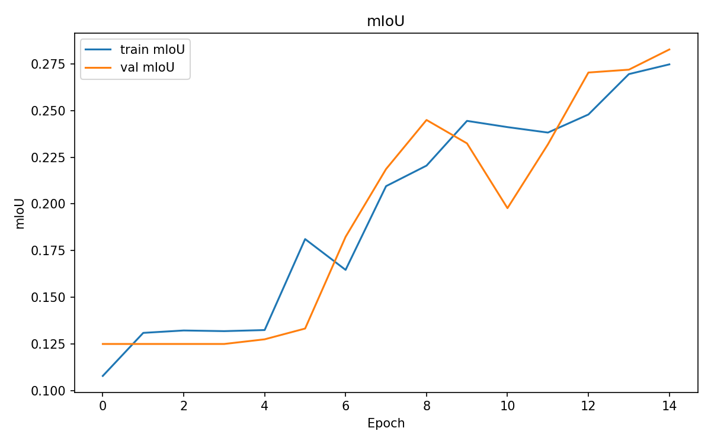
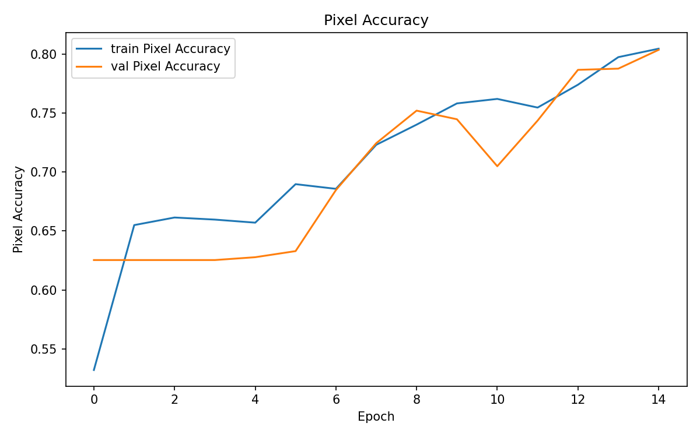
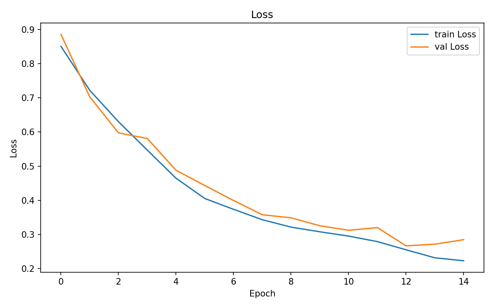
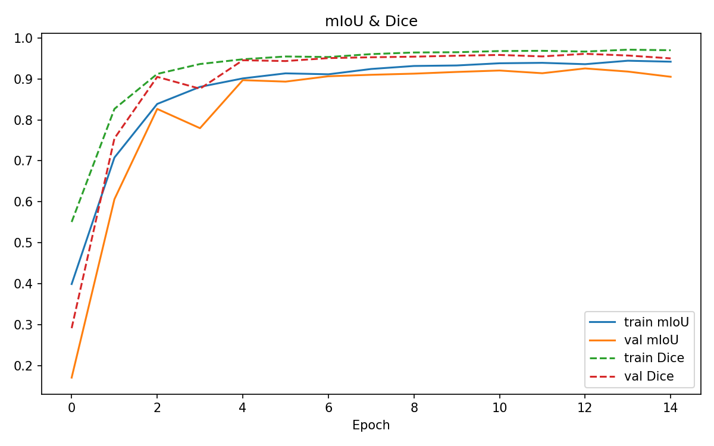
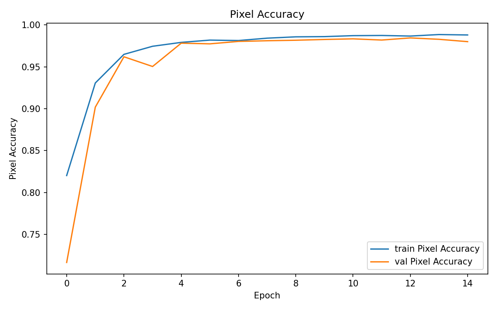

# 🖼️ Image Segmentation from Scratch: FCN → U-Net → SMP


---

## 📌 프로젝트 요약 (Project Overview)
본 프로젝트는 이미지 세그멘테이션을 단순한 라이브러리 호출 수준을 넘어, **논문 구현 → 직접 설계 → 라이브러리 활용**의 3단계 심화 학습으로 완성한 포트폴리오입니다. FCN 논문을 직접 구현하며 세그멘테이션의 원리를 체득하고, U-Net 아키텍처를 밑바닥부터 설계하며 Encoder-Decoder 구조의 본질을 이해한 뒤, 실무 수준의 SMP 라이브러리로 확장하여 성능을 검증하였습니다. 단순 코드 재현이 아닌, **"왜 이 구조인가"를 스스로 설명할 수 있는 이해의 깊이**를 데이터로 증명하려 노력했습니다.

---

## 🎯 핵심 목표 (Motivation)
| 핵심 역량 | 적용 단계 &emsp;&emsp;&emsp;&emsp;&emsp;&emsp;| 상세 목표 및 엔지니어링 포인트 |
| :--- | :---: | :--- |
| **논문 구현 능력<br>(Paper Implementation)** | **Stage 1. FCN** | VGG16 Backbone + Skip Connection 구조를 논문 스펙대로 직접 구현하여 이진 세그멘테이션 수행 |
| **아키텍처 설계 능력<br>(Architecture Design)** | **Stage 2. U-Net** | Encoder-Decoder + Concat 기반 Skip Connection을 밑바닥부터 설계하여 다중 클래스 세그멘테이션으로 확장 |
| **실무 적용 능력<br>(Production-level Tooling)** | **Stage 3. SMP** | ResNet34 Backbone + JaccardLoss + SMP Metrics를 활용하여 실무 수준의 파이프라인 구축 |

---

## 1. 실험 환경 및 단계별 도전 과제 (3 Stages)
| 단계 | 모델 | 데이터셋 | Task | 도전 과제 |
| :---: | :--- | :--- | :--- | :--- |
| **Stage 1 (🥉)** | **FCN8s** | Flood Area Segmentation | Binary Segmentation | VGG16 기반 Skip Connection 직접 구현, 마스크 Binary화 및 데이터 전처리 |
| **Stage 2 (🥈)** | **U-Net (Custom)** | Car Segmentation (5 classes) | Multi-class Segmentation | Encoder-Decoder 구조 직접 설계, Concat 기반 Skip Connection, mIoU 계산 로직 구현 |
| **Stage 3 (🥇)** | **SMP U-Net** | Car Segmentation (5 classes) | Multi-class Segmentation | ResNet34 Pretrained Backbone, JaccardLoss 적용, SMP Metrics(IoU, Dice, Accuracy) 파이프라인 구축 |

---

## 2. 프로젝트 구조
    ├── src/
    │   └── main.py                  # 3개 Stage 통합 학습 및 그래프 자동 저장
    ├── results/
    │   ├── fcn_loss.png             # Stage 1: Train/Val Loss 곡선
    │   ├── fcn_iou.png              # Stage 1: IoU 곡선
    │   ├── fcn_pa.png               # Stage 1: Pixel Accuracy 곡선
    │   ├── unet_loss.png            # Stage 2: Train/Val Loss 곡선
    │   ├── unet_iou.png             # Stage 2: mIoU 곡선
    │   ├── unet_pa.png              # Stage 2: Pixel Accuracy 곡선
    │   ├── smp_loss.png             # Stage 3: Train/Val Loss 곡선
    │   ├── smp_iou_dice.png         # Stage 3: mIoU + Dice 곡선
    │   └── smp_pa.png               # Stage 3: Pixel Accuracy 곡선
    ├── .gitignore                   # 불필요한 파일 업로드 방지
    ├── LICENSE                      # MIT License (AD-Styles)
    ├── README.md                    # 프로젝트 리포트
    └── requirements.txt             # 라이브러리 설치 목록
  
---

## 3. 모델 아키텍처 상세 (Architecture Details)

### 🔹 Stage 1. FCN8s — 논문 직접 구현

FCN(Fully Convolutional Network)은 이미지 전체를 픽셀 단위로 분류하는 세그멘테이션의 시초 구조입니다.

- **Backbone**: VGG16 (Pretrained) — Block3, Block4, Block5로 분리
- **추가 Conv**: Conv6 (512→4096), Conv7 (4096→4096)
- **Skip Connection**: Pool3, Pool4의 Feature Map을 1×1 Conv로 채널 조정 후 **덧셈(+)** 연산으로 결합
- **Upsampling**: ConvTranspose2d — 2배 × 2회 + 8배 × 1회 = 원본 해상도 복원
- **Loss**: BCEWithLogitsLoss (이진 분류)
- **평가지표**: IoU, Pixel Accuracy

```
Input (B,3,H,W)
    → VGG16 Block3 → p3 (B,256,H/8,W/8)
    → VGG16 Block4 → p4 (B,512,H/16,W/16)
    → VGG16 Block5 → Conv6 → Conv7 → score (B,1,H/32,W/32)
    → Upsample×2 + p4 skip → Upsample×2 + p3 skip → Upsample×8
    → Output (B,1,H,W)
```

---

### 🔹 Stage 2. U-Net — 밑바닥부터 직접 설계

U-Net은 FCN과 달리 Encoder 각 단계의 Feature Map을 Decoder에 **Concat**하여 공간 정보를 더 정밀하게 복원합니다.

- **Encoder**: 4단계 Double Conv(3×3) + MaxPool(2×2) — 채널: 64→128→256→512
- **Bottleneck**: Double Conv — 512→1024
- **Decoder**: 4단계 ConvTranspose2d(2×2) + Encoder Feature Map **Concat(torch.cat)** + Double Conv
- **Final Layer**: 1×1 Conv → 클래스 수만큼 채널 출력
- **Loss**: CrossEntropyLoss (다중 클래스)
- **평가지표**: mean IoU (클래스별 IoU 평균), mean Pixel Accuracy

```
Encoder:  [3]→64→128→256→512→[Bottleneck]→1024
Decoder:  1024→512(+cat e4)→256(+cat e3)→128(+cat e2)→64(+cat e1)→num_classes
```

> **FCN의 Skip Connection(+덧셈)과의 차이**: U-Net은 Concat을 사용하여 채널 정보를 보존하므로 세밀한 경계 복원에 유리합니다.

---

### 🔹 Stage 3. SMP U-Net — 실무 수준 파이프라인

`segmentation_models_pytorch` 라이브러리를 활용하여 검증된 아키텍처와 손실 함수를 실무 수준으로 적용했습니다.

- **Backbone**: ResNet34 (ImageNet Pretrained)
- **Loss**: `smp.losses.JaccardLoss` (= IoU Loss) — IoU를 직접 최적화
- **Metrics**: `smp.metrics` — Confusion Matrix(TP/FP/FN/TN) 기반 IoU, Dice Coefficient(F1), Accuracy
- **Multi-class vs Multi-label 개념 정리**:

| 구분 | Multi-class | Multi-label |
| :---: | :--- | :--- |
| 픽셀당 클래스 수 | 1개 (상호 배타적) | 여러 개 (공존 가능) |
| 마스크 형태 | (B, H, W) | (B, C, H, W) |
| 활성화 함수 | Softmax | Sigmoid |
| 손실 함수 | CrossEntropy / JaccardLoss(multiclass) | BCEWithLogitsLoss |

---

## 4. 실험 결과 (Results)

### 최종 성능 요약

| Stage | 모델 | Val Loss | Val IoU | Val Pixel Accuracy |
| :---: | :--- | :---: | :---: | :---: |
| **Stage 1** | FCN8s | 0.27 | 0.72 | 0.89 |
| **Stage 2** | U-Net (Custom) | 0.54 | 0.28 | 0.80 |
| **Stage 3** | SMP U-Net (ResNet34) | 0.22 | **0.91** | **0.98** |

---

### 📈 Stage 1. FCN8s — Flood Area Binary Segmentation
| 학습 손실 (Train/Val Loss) | IoU 곡선 | Pixel Accuracy 곡선 |
| :---: | :---: | :---: |
|  |  |  |

- **최종 성능**: Val Loss `0.27` / Val IoU `0.72` / Val Pixel Accuracy `0.89`
- **엔지니어링 인사이트**: Val 곡선이 Train보다 지속적으로 높게 수렴하는 패턴이 관찰되었습니다. 290장이라는 소규모 데이터셋임에도 과적합 없이 일반화가 잘 이루어졌으며, 이는 VGG16 Pretrained Backbone의 강력한 특징 추출 능력 덕분입니다. 또한 인터넷 크롤링 데이터 특성상 RGBA, Grayscale 등 채널 불일치 이미지 3장을 사전 필터링하는 데이터 품질 관리 과정이 학습 안정성에 직접적인 영향을 미쳤습니다.

---

### 📈 Stage 2. U-Net — Car Multi-class Segmentation (Custom)
| 학습 손실 (Train/Val Loss) | mIoU 곡선 | Pixel Accuracy 곡선 |
| :---: | :---: | :---: |
|  |  |  |

- **최종 성능**: Val Loss `0.54` / Val mIoU `0.28` / Val Pixel Accuracy `0.80`
- **엔지니어링 인사이트**: mIoU가 0.28로 상대적으로 낮게 나타난 것은 모델 한계가 아닌 **데이터셋 한계(211장, 5 classes)**에 기인합니다. 주목할 점은 15 Epoch 시점에도 mIoU가 지속 상승 중이었다는 것으로, Epoch을 늘리면 추가 개선 여지가 있음을 확인했습니다. FCN 대비 Concat 기반 Skip Connection이 차량 부품처럼 경계가 복잡한 영역에서 공간 정보를 더 정밀하게 복원함을 곡선 패턴을 통해 확인했습니다.

---

### 📈 Stage 3. SMP U-Net — Car Multi-class Segmentation (Library)
| 학습 손실 (Train/Val Loss) | mIoU / Dice 곡선 | Pixel Accuracy 곡선 |
| :---: | :---: | :---: |
|  |  |  |

- **최종 성능**: Val Loss `0.22` / Val mIoU `0.91` / Val Dice `0.97` / Val Pixel Accuracy `0.98`
- **엔지니어링 인사이트**: Stage 2(mIoU 0.28) 대비 Stage 3(mIoU 0.91)의 압도적인 성능 차이는 **ResNet34 ImageNet Pretrained Backbone**의 위력을 수치로 증명합니다. 또한 JaccardLoss(IoU를 직접 최적화)가 손실 함수와 평가 지표를 정렬(Alignment)시켜 단 5 Epoch 만에 mIoU 0.90을 돌파하는 빠른 수렴을 이끌어냈습니다. Dice와 mIoU가 함께 0.95 이상으로 수렴한 것은 클래스 불균형 상황에서도 모든 클래스를 고르게 잘 학습했음을 의미합니다.

---

## 5. 향후 과제 (Future Work)
현재 세 모델은 모두 **224×224 고정 해상도**와 **정적 데이터셋** 환경에서 학습되었습니다. 실무 적용을 위해 다음 방향으로 확장할 계획입니다.

- **Data Augmentation 강화**: `albumentations` 라이브러리를 활용한 Flip, Rotate, ElasticTransform 등 세그멘테이션 특화 증강 적용
- **더 큰 Backbone 실험**: ResNet50, EfficientNet 기반으로 Backbone을 교체하여 성능 상한선 탐색
- **실시간 추론 최적화**: TorchScript 또는 ONNX 변환을 통한 경량화 및 추론 속도 개선
- **Instance Segmentation으로 확장**: Semantic → Instance 세그멘테이션(Mask R-CNN)으로 발전하여 개별 객체 식별 능력 검증

---

## 6. 💡 회고록 (Retrospective)
이번 프로젝트에서는 세그멘테이션을 단순히 라이브러리 API 호출 수준으로 익히는 것이 아닌, 논문의 수식과 그림을 코드로 직접 옮기는 구현 능력과, 그 구조가 왜 그렇게 설계되었는지를 이해하는 통찰력을 함께 키우는 데 집중했습니다.

- **Stage 1 (FCN)**: 처음 FCN 논문을 마주했을 때 가장 낯설었던 개념은 Skip Connection이었습니다. Pool3, Pool4의 Feature Map을 왜 다시 꺼내 쓰는가에 대한 답을 직접 구현하며 찾았습니다. 깊은 레이어일수록 의미(Semantic) 정보는 풍부하지만 공간(Spatial) 정보는 소실됩니다. Skip Connection은 이 두 정보를 합산하여 경계가 살아있는 세그멘테이션 맵을 만드는 핵심 장치임을 코드 레벨에서 체득했습니다.

- **Stage 2 (U-Net)**: FCN과의 결정적 차이는 Skip Connection 방식에 있었습니다. 덧셈(+)은 정보를 혼합하지만 Concat은 보존합니다. 채널을 그대로 이어붙임으로써 Decoder가 Encoder의 세밀한 공간 정보를 손실 없이 참조할 수 있게 되고, 이것이 차량 부품처럼 경계가 복잡한 대상에서 U-Net이 FCN보다 우수한 이유임을 직접 비교하며 확인했습니다.

- **Stage 3 (SMP)**: 직접 구현 이후 라이브러리를 사용하니 그 설계 의도가 명확하게 읽혔습니다. JaccardLoss가 단순히 "좋은 손실 함수"가 아니라 평가 지표인 IoU와 수식적으로 동일한 방향을 최적화한다는 점, 그리고 SMP Metrics의 Confusion Matrix 기반 설계가 클래스별 오분류 패턴을 분석하는 데 얼마나 유용한지를 이해할 수 있었습니다. 이 경험을 통해 라이브러리를 도구로만 쓰는 것과 그 내부 원리를 이해하고 쓰는 것의 차이가 실무 문제 해결 능력에서 얼마나 큰 격차를 만드는지를 실감했습니다.

세 단계를 거치며 얻은 가장 큰 수확은 기술 스택이 아닌 **"구조를 읽는 눈"** 입니다. 새로운 아키텍처를 마주했을 때 논문이든 코드든 그 설계 의도를 파악하고 직접 구현할 수 있는 능력, 그리고 라이브러리의 추상화 뒤에 숨겨진 수식을 이해하고 활용하는 능력이 이번 프로젝트를 통해 한 단계 성장했다고 자신 있게 말할 수 있습니다.
